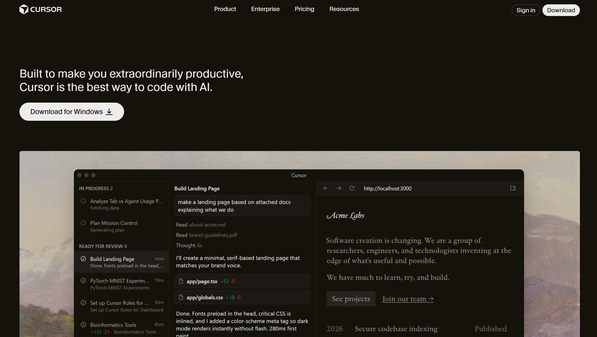
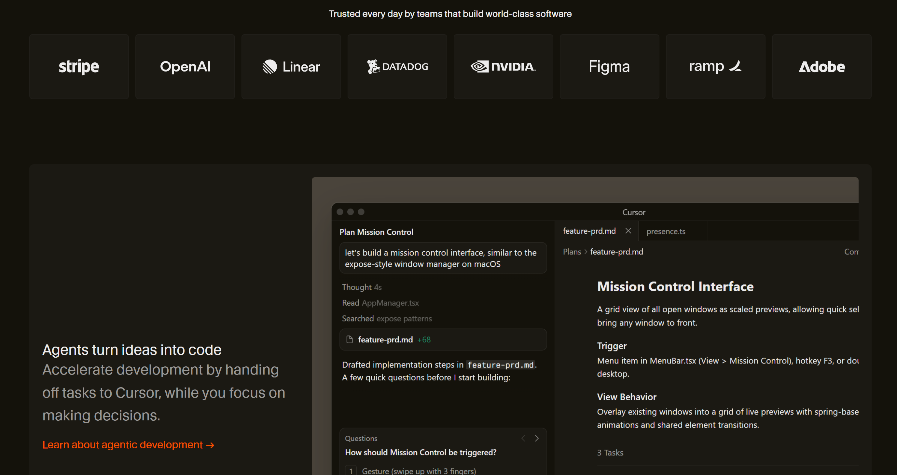
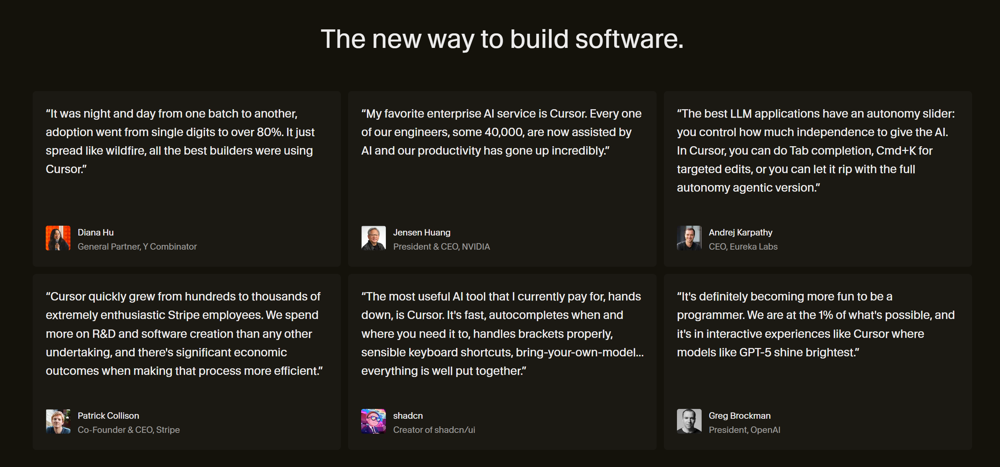

# Cursor UI Clone

A static UI clone of the Cursor homepage built using **HTML and CSS**.  
This project focuses on replicating the visual design, layout structure, and overall aesthetic of the Cursor website for frontend practice.

---

## Project Overview

This repository contains a frontend-only clone of the Cursor homepage.  
The goal of this project was to practice modern UI cloning, dark-themed layouts, spacing, typography, and component-based page structure using vanilla HTML and CSS.

---

## Tech Stack

- HTML5
- CSS3

---

## UI Highlights

- Dark-themed modern UI
- Clean typography inspired by Cursor
- Feature cards layout
- Hero section with call-to-action
- Minimal and developer-focused design

---

## Live Demo

GitHub Pages link:

https://SyedHammad-cs.github.io/cursor-clone/

---

## Screenshots

---
